# Somporko - A social media platform for the people of Bangladesh

Created by [Md. Almas Ali][1] a rewite of social-media private platform project in Django for personal use case. Now, it is open source and can be used by anyone. It was mainly created for the people of Bangladesh for having a safe and secure social media platform. Now, anyone can use it for free to gain knowledge about Django and social media platform. It is not a complete project and still in development. So, if you want to contribute, you are welcome. 

## Screenshots

### Home Page

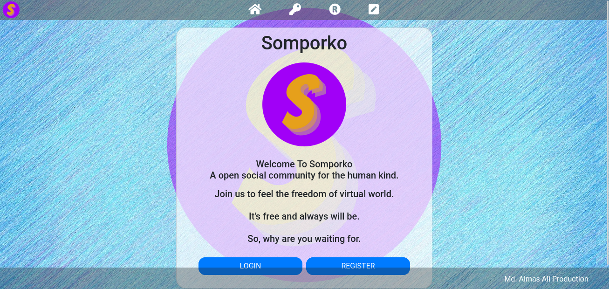

### Login Page

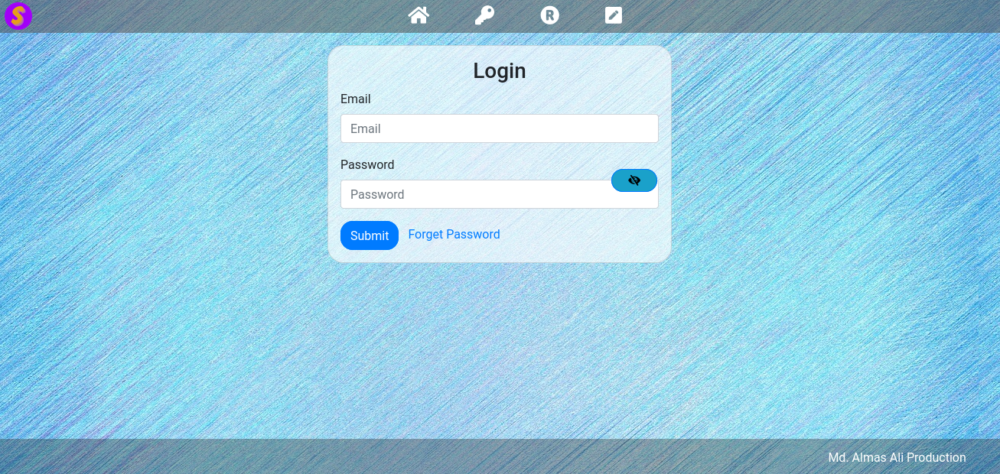

### Register Page

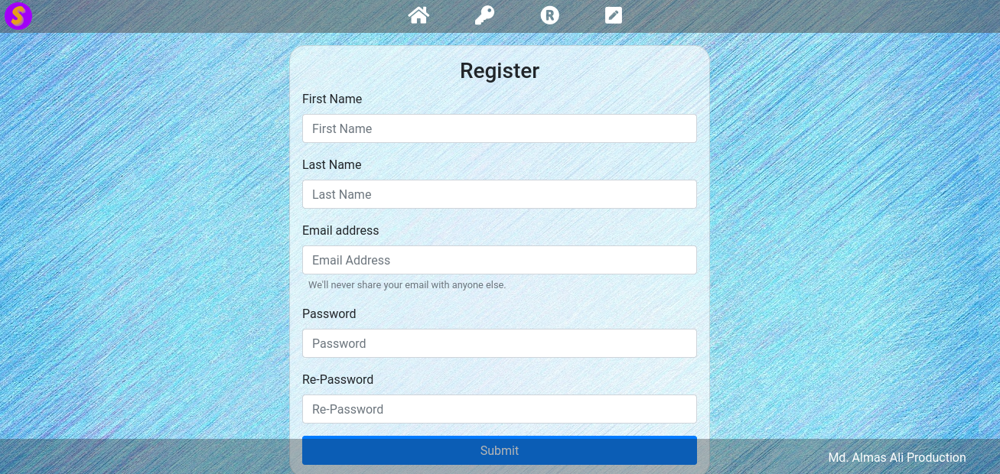

### Password Reset Page

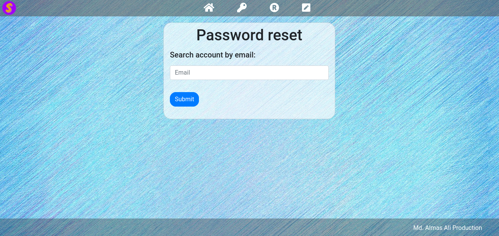

### Report Page

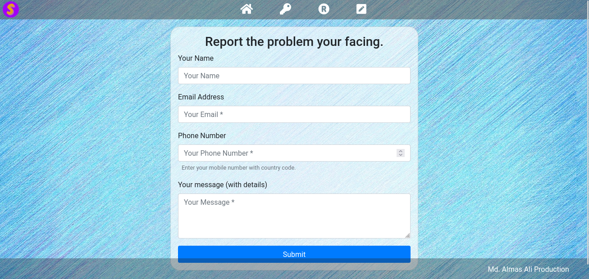

### Profile Page

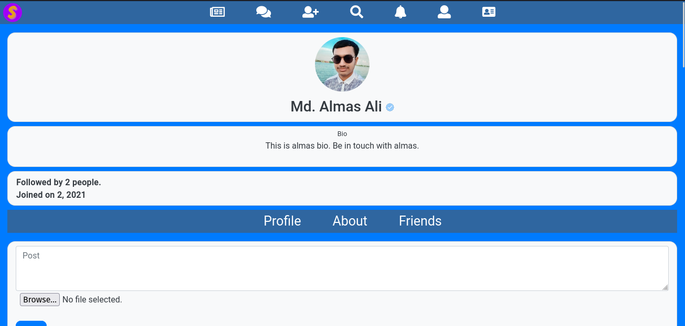

### Friend Request Example

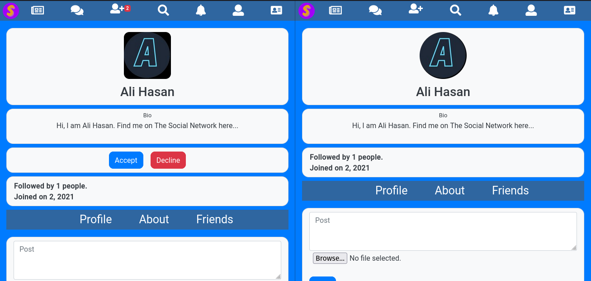

### Friend Request List

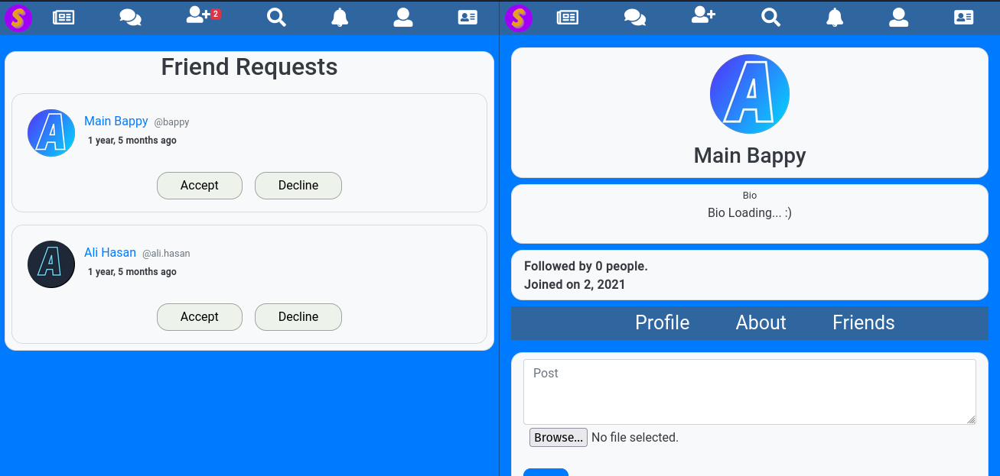

### Search Page

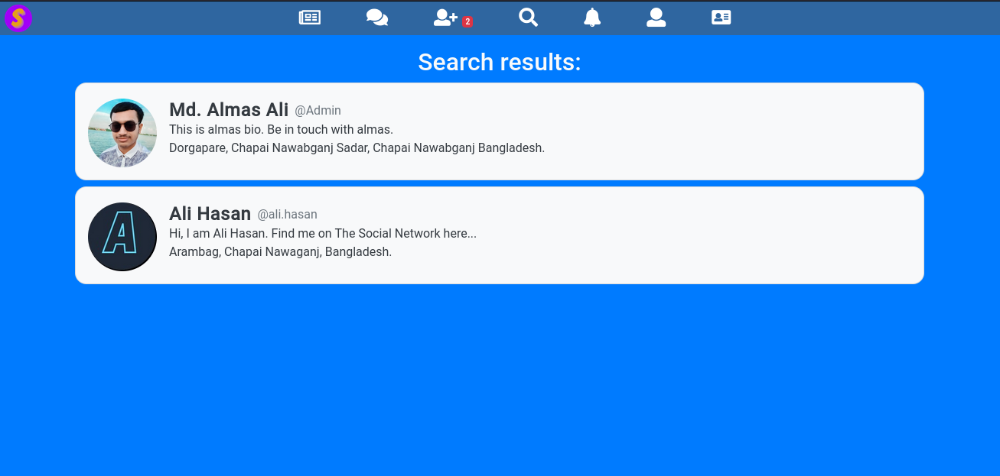

### Newsfeed Page

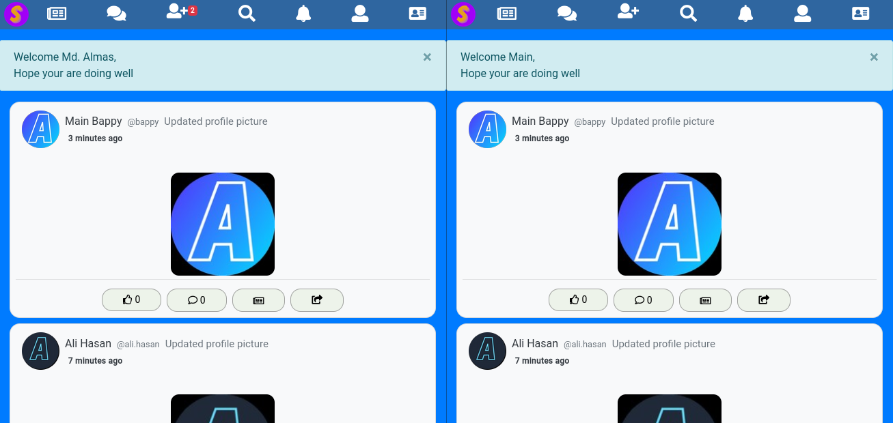

### Post Page

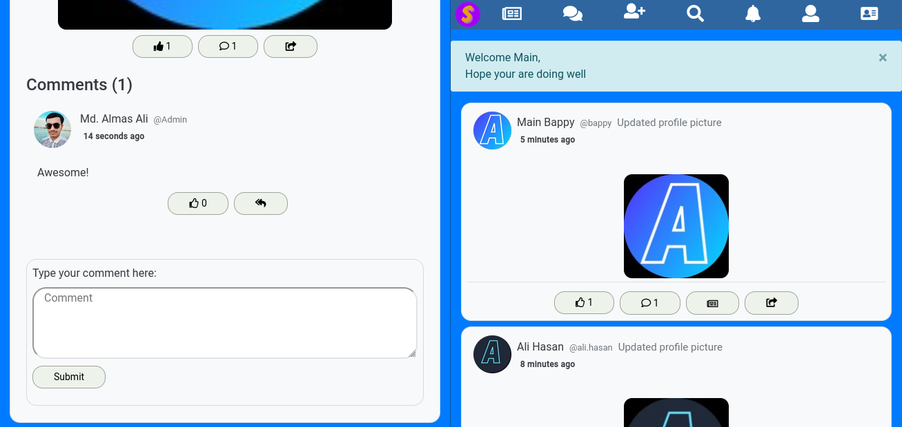

### Comment Page

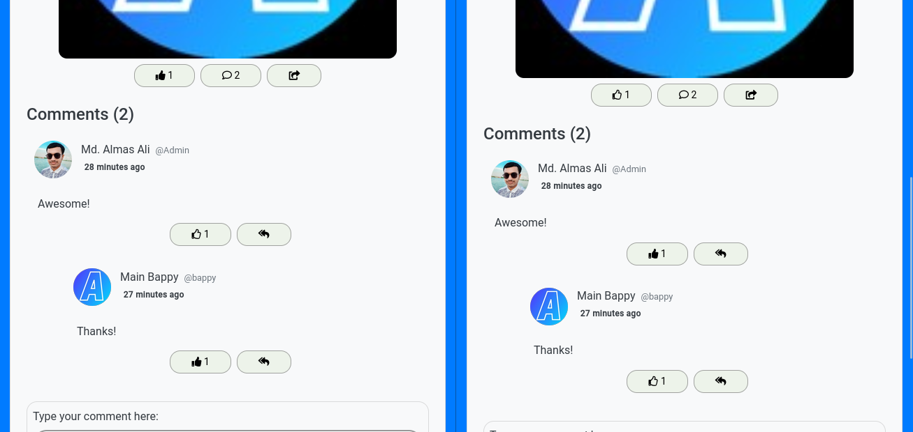

### Settings Page

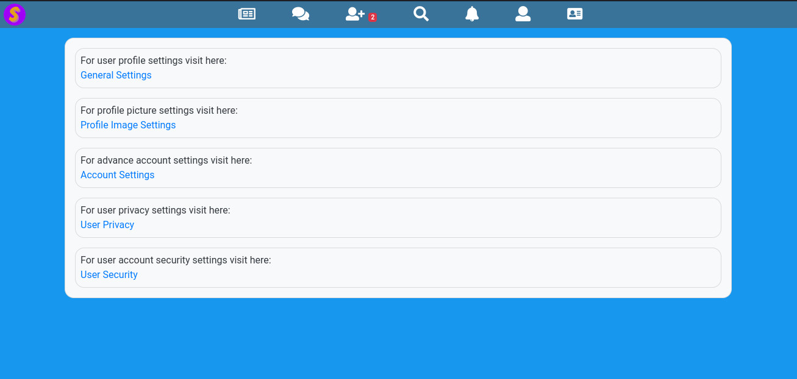

### Change Password

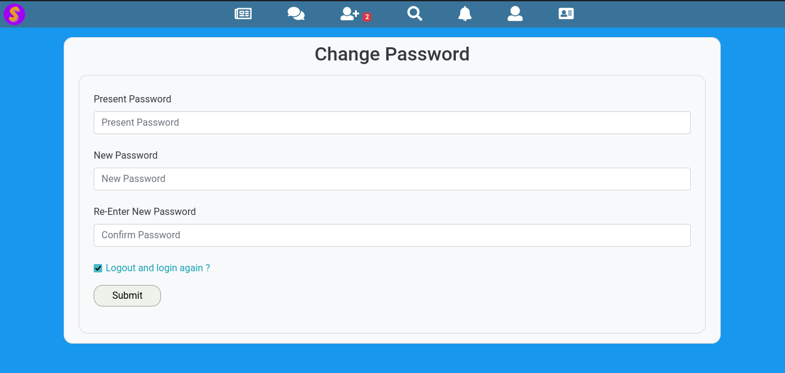

### User Login Record

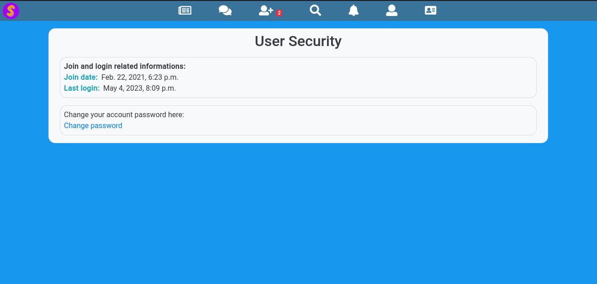

### Profile delete confirmation

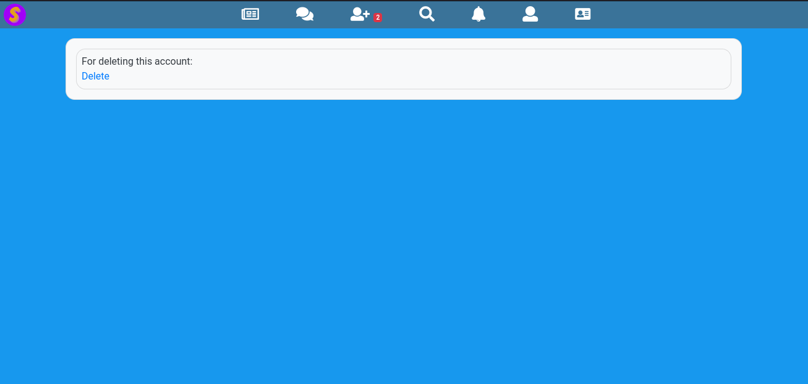

### Profile delete confirmation

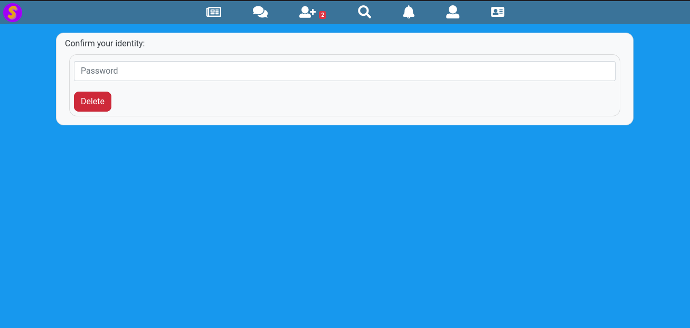

### Privacy Settings

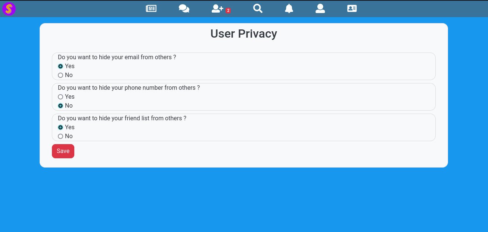


## Features

All the features of the project are listed below:

- Create account
- Login
- Logout
- Create post
- Edit post
- Delete post
- Like post
- Comment on post
- Like comment
- Reply to comment
- Like reply
- Share post
- Delete comment
- Friend request
- Accept friend request
- Reject friend request
- Unfriend
- Follow user
- Unfollow user
- Search user
- Search post
- Profile view
- Profile edit
- Profile picture upload
- Change password
- Change email
- Change username
- Change name
- Blue tick verification
- Notification
- Email verification
- Password reset
- Email reset
- Email notification
- Account deactivation
- Account deletion
- Report post
- Report comment
- Report user
- Settings page
- About page
- Terms and conditions page
- Privacy policy page
- Cookie policy page
- Contact page
- Help page
- General settings
- Security settings
- Privacy settings
- Profile settings
- Notification settings
- One to one chat

## Installation

Somporko requires [Python](https://www.python.org/) v3.8+ to run. Install the dependencies and start the server. Follow the steps below to install the project.

```bash
#  Clone the repository
git clone https://github.com/Almas-Ali/Somporko.git

# Go to the project directory
cd Somporko

# Create a virtual environment
python -m virtualenv venv

# Activate the virtual environment
venv\Scripts\activate (Windows)
source venv/bin/activate (Linux)

# Install all the dependencies from requirements.txt
pip install -r requirements.txt

# Create a .env file in the root directory 
copy .env.example .env (Windows)
cp .env.example .env (Linux)

# Change your secret key in .env file
# Name Secret key as SECRET_KEY

# Generate Migration files
python manage.py makemigrations

# Migrate the database
python manage.py migrate

# Create a superuser
# Enter your username, email and password for the superuser
python manage.py createsuperuser

# Run the server
python manage.py runserver

# Open the browser and go to http://127.0.0.1:8000/
```

> ***Note:*** *If you face any kind of errors please let us know by creating an issue. We will try to fix it as soon as possible.*


## Contributing

**Want to contribute? Great!** Fork the repository and start contributing. You can submit anything you think will be useful for the project. If we think it is useful, we will merge it. **Thank you**.


## How to contribute

- Fork the repository
- Clone the repository
- Create a branch
- Make changes
- Commit and push
- Create a pull request

Thats all about it! We will review your pull request and merge it if it is useful. Thank you for your contribution.


## License

Custom License. See [LICENSE](./LICENSE) for more information.


[1]: <https://github.com/Almas-Ali> "Md. Almas Ali"
[2]: <https://github.com/Almas-Ali/Somporko> "Somporko" 